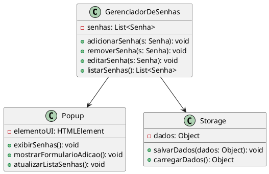
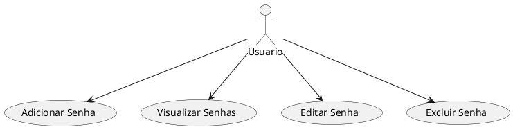

# Meu Gerenciador de Senhas

Esta é uma extensão do Chrome para gerenciar senhas.

## Estrutura do Projeto

- `src/`: Contém os arquivos principais da extensão.
  - `css/`: Contém os arquivos de estilo CSS.
  - `js/`: Contém os arquivos de script JavaScript.
  - `icons/`: Contém os ícones da extensão.
  - `popup.html`: Arquivo HTML para o popup da extensão.
- `manifest.json`: Arquivo de configuração da extensão.
- `README.md`: Este arquivo de documentação.

## Como Usar

1. Abra o Chrome e vá para `chrome://extensions/`.
2. Ative o "Modo do desenvolvedor".
3. Clique em "Carregar sem compactação" e selecione a pasta do projeto.
4. A extensão estará disponível na barra de ferramentas.

## Contribuição

Sinta-se à vontade para contribuir com melhorias!

## Licença

Este projeto está licenciado sob a MIT License.

### **Diagrama de Classes**

Um diagrama de classes pode mostrar as principais classes e suas interações. 

- **GerenciadorDeSenhas:** Classe principal que gerencia o armazenamento e a manipulação das senhas.
- **Popup:** Classe que representa a interface do usuário (o popup da extensão).
- **Storage:** Classe que lida com a persistência dos dados usando a API de armazenamento do Chrome.

Aqui está uma descrição textual para um diagrama de classes simplificado:

```
+------------------+
| GerenciadorDeSenhas |
+------------------+
| - senhas: List<Senha> |
+------------------+
| + adicionarSenha(s: Senha): void |
| + removerSenha(s: Senha): void |
| + editarSenha(s: Senha): void |
| + listarSenhas(): List<Senha> |
+------------------+

       |
       |
       v

+------------------+
| Popup            |
+------------------+
| - elementoUI: HTMLElement |
+------------------+
| + exibirSenhas(): void |
| + mostrarFormularioAdicao(): void |
| + atualizarListaSenhas(): void |
+------------------+

       |
       |
       v

+------------------+
| Storage          |
+------------------+
| - dados: Object  |
+------------------+
| + salvarDados(dados: Object): void |
| + carregarDados(): Object |
+------------------+
```

### **Diagrama de Casos de Uso**

Um diagrama de casos de uso mostra como os usuários interagem com o sistema. Para a sua extensão, os casos de uso podem incluir:

- **Adicionar Senha**
- **Visualizar Senhas**
- **Editar Senha**
- **Excluir Senha**

Aqui está uma descrição textual para um diagrama de casos de uso simplificado:

```
     +-----------------+
     |     Usuário     |
     +-----------------+
            |
            | 
  +---------+----------+
  |                    |
  v                    v
+------------------+  +------------------+
| Adicionar Senha  |  | Visualizar Senhas|
+------------------+  +------------------+
            |
            v
+------------------+
| Editar Senha     |
+------------------+
            |
            v
+------------------+
| Excluir Senha    |
+------------------+
```

Aqui está um exemplo de código PlantUML para o diagrama de classes:



E aqui um exemplo para o diagrama de casos de uso:

